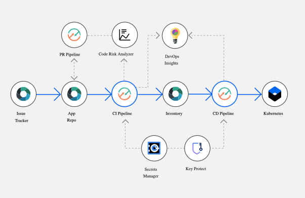

#  Develop a Kubernetes app

### Continuously deliver a secure container app to a Kubernetes Cluster
This Hello World application uses Docker with Node.js and includes a DevOps toolchain that is pre-configured for continuous delivery with Vulnerability Advisor, source control, issue tracking, and online editing, and deployment to the IBM Kubernetes Service.

Application code is stored in source control, along with its Dockerfile and its Kubernetes deployment script.
The target cluster is configured during toolchain setup (using an IBM Cloud API key and cluster name). You can later change these by altering the Delivery Pipeline configuration.
Any code change to the Git repo will automatically be built, validated and deployed into the Kubernetes cluster.



### To get started, click this button:
[](https://cloud.ibm.com/devops/setup/deploy?repository=https://github.ibm.com/open-toolchain/secure-app-toolchain)

It implements the following best practices:
- seperate Continuous Integration(CI) and Continuous Delivery(CD) pipelines.
- different deployment strategies (Rolling, Blue/Green and Canary) 
- sanity check the Dockerfile prior to attempting creating the image,
- build container image on every Git commit, setting a tag based on build number, timestamp and commit id for traceability
- use a private image registry to store the built image, automatically configure access permissions for target cluster deployment using API tokens than can be revoked,
- check container image for security vulnerabilities,
- insert the built image tag into the deployment manifest automatically,
- use an explicit namespace in cluster to insulate each deployment (and make it easy to clear, by "kubectl delete namespace"),

### Steps

#### Welcome Page

- Toolchain Name - Unique name to identify your toolchain

- Region - Select the region where toolchain is to be deployed (Ex: us-south)

#### Application Repository Configuration

- Provide your application repo details or go with default provided repo.

#### Inventory Repository Configuration

1. Inventory repo is used to capture the build and artifact metadata.

2. A successful CI build uploads the artifact to IBM Container registry(ICR) and commits the build metadata in JSON Format to the Inventory Repository. The CD Pipeline listens for changes in the inventory and triggers a pipeline run to fetch the artifact from IBM Container Registry and deploys that artifact to your instances.

#### Secrets

Kindly refer [Secrets Manager in Detail](#secrets-manager-in-detail])  

1. Identify your secrets store. 
2. Select the secrets store instance which you want to use in the toolchain.


#### Deployment Target

Select the IBM Kubernetes cluster on which you want to deploy your application.

#### Deployment Strategy

Select the Deployment Strategy for releasing your application to IBM Kubernetes cluster. Kindly refer [Deployment Strategies in Detail](#deployment-strategies-in-detail])  

#### Optional Tools

Select the optional tools as required in your toolchain.

#### Summary

This section will list if there are any issues in the inputs that are provided in previous steps.

---
## Additional Information

### Secrets Manager in Detail

Several tools in this toolchain, and possibly in your customizable scripts, require secrets to access privileged resources. An IBM Cloud API key is an example of such a secret. These secrets must be securely stored within an IBM-recommended secrets management tool, such as [IBM Key Protect for IBM Cloud](https://www.ibm.com/cloud/key-protect), [IBM Cloud Secrets Manager](https://www.ibm.com/cloud/secrets-manager), or [Hashicorp Vault](https://www.vaultproject.io/). The secrets management tool can be integrated into the toolchain so that you can easily reference the secrets in your Tekton pipeline.

`key-protect` :- Key Protect is a cloud-based security service that provides life cycle management for encryption keys that are used in IBM Cloud services or customer-built applications

`secrets-manager` :- With Secrets Manager you can create, lease, and centrally manage secrets that are used in IBM Cloud services or your custom-built applications.

### Deployment Strategies in Detail

In Kubernetes there are a few different ways to release an application, it is necessary to choose the right strategy to make your infrastructure reliable during an application update.

These are the different deployment strategies that are supported by the toolchain.

##### Blue Green Deployment

For the first deployment:- 
```
1. Check if the Ingress controller exists
2. If not, update the current deployment as blue and perform deployment.

For the subsequent deployment:-

1. Identify the service where the ingress controller is pointing.
2. If it is pointing to blue service, then we will create a deployment name  as green deployment, else if it is pointing to green, then we will create a deployment name  as blue deployment.
3. Perform the new deployment. (This will update the old deployment if older version exists)
4. Perform acceptance test on latest deployment.
5. If acceptance test fails on latest deployment, then fail the pipeline. Developer can debug the latest deployment as live traffic is not affected.
6. If acceptance test passes, then point the ingress controller to new deployment. 
7. Old deployment will stay as is for backup/debug purpose.

```


---
### Learn more 

* Blog [Continuously deliver your app to Kubernetes with Bluemix](https://www.ibm.com/blogs/cloud-archive/2017/07/continuously-deliver-your-app-to-kubernetes-with-bluemix/)
* Step by step [tutorial](https://www.ibm.com/cloud/architecture/tutorials/use-develop-kubernetes-app-toolchain)
* [Getting started with clusters](https://cloud.ibm.com/docs/containers?topic=containers-getting-started)
* [Getting started with toolchains](https://cloud.ibm.com/devops/getting-started)
* [Documentation](https://cloud.ibm.com/docs/services/ContinuousDelivery?topic=ContinuousDelivery-getting-started&pos=2)
